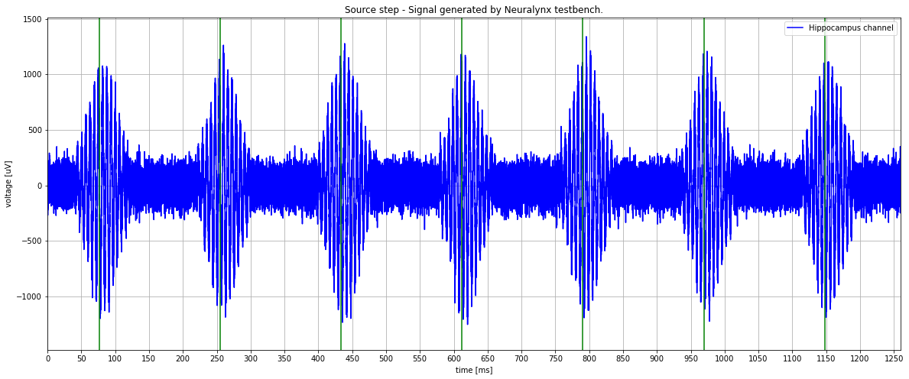
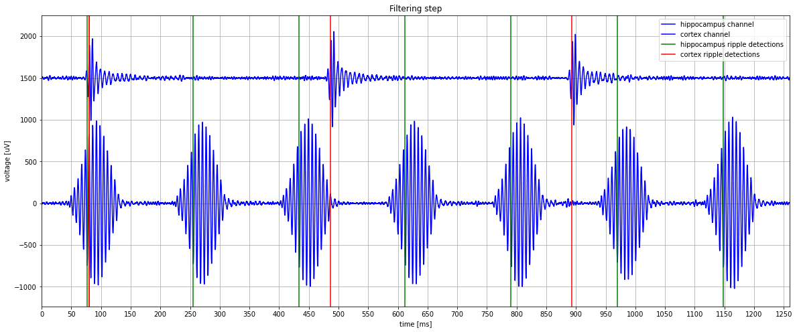
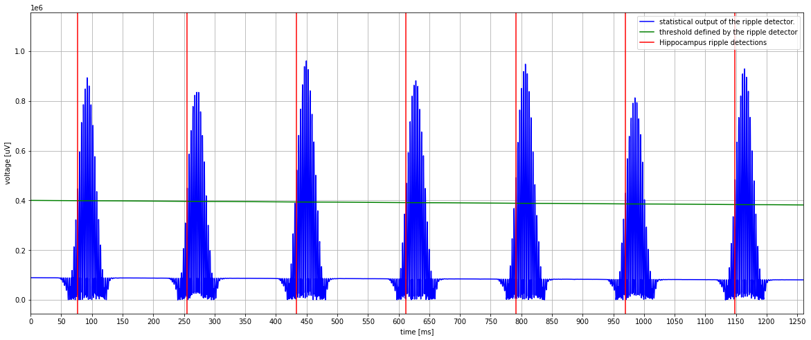
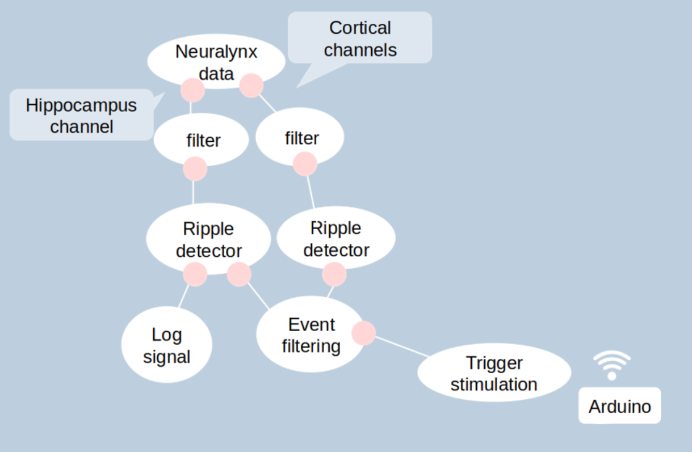

Hippocampal ripple detection
============================

Overview
--------

Implementation
--------------

Algorithm
.........

- **Recording**: the hippocampal activity is recorded at 4 or 32 kHz depending on the experiment.
  Experiments that only focus on SWR are done at 4 kHz, whereas those that also use single cell
  signal (between 300 and 6000 Hz) have to be recorded at 32 kHz.

- **Filtering**: the filter is a Chebyshev type II with a pass-band from 130 to 283 Hz and
  transition edges of 10%. This specific design comes from the initial wish to reject as many gamma bursts as possible.

- **Envelope estimation**: the simple squared value of the filtered signal is the estimation
  of the envelope in this algorithm. While neglecting to smooth the signal may lead to
  spurious detections due to outliers, the advantage of speed of detection obtained with
  this choice outweighs the disadvantage of false detections caused by a few rare outliers.

- **Thresholding**: the threshold is permanently modified as the experiment runs.
  Indeed, it is based on statistical properties of the envelope which are the mean and the Mean Absolute Deviation (MAD).
  Every time a new value is computed (on the last time bin of 10 ms), it is added to the
  previous statistics with a predefined weight (α).

The corresponding equations are:

.. math::

    mean = (1  -α )* mean + α   * (mean of last time bin)
    
    MAD  = (1  - α)  * MAD + α  * |sample value  - mean|
    
    threshold = mean + arbitrary factor *MAD

The arbitrary factor is what the user has to tune for every experiment. 
The higher it is, the less the number of detections will be.

- **Cortical channel comparison**: as the rat is moving in its environment, some actions
  like chewing and bumping lead to artifacts in the neural signal. Fortunately, they are
  largely spread in the brain so that we can detect them outside hippocampus. This
  property is harnessed to reject them when they trigger a detection. An electrode records
  the signal in the cortex (where no SWRs occur) and the ripple detection algorithm is
  also running on it. If the same event is detected in the hippocampus and in the cortex,
  it is considered as an artifact and it is directly rejected.

- **Trigger stimulation**: To avoid over-stimulation, a post-processing technique consists of blocking any detection that
  occurs less than 150 ms after a stimulation. This is called the lock-out period.
  There is also three modes to deliver stimulation:
  - enabled - only detections are sent
  - ontime  - directly sent after detection
  - delayed - directly sent detection and then sent stimulation after a uniform-random time (ms) chose in a range (see option of EventDelayed).

  This mode can be change in running time by modifying the delayed and enabled state.

Graph
.....

**Graph description:**

- **source** (Neuralynx data): :ref:`NlxReader`
- **ripple filter 1**: :ref:`MultiChannelFilter`
- **ripple filter 2**: :ref:`MultiChannelFilter`
- **hippocampus detector**: :ref:`RippleDetector`
- **cortex detector**: :ref:`RippleDetector`
- **network sink** (log signal) : :ref:`ZMQSerializer`
- **event filter** : :ref:`EventFilter`
- **event delayed** (trigger stimulation) : :ref:`EventDelayed`
- **ttl output** (communication to the arduino): :ref:`SerialOutput`

User input in real-time
.......................

Processor ripple filter (1-2) (:ref:`RippleDetector`):

- threshold dev (double)
- smooth time (double): integration time for signal statistics. Must be a positive number.
- detection lockout time (double): Current refractory period following threshold crossing that is not considered for  updating signal statistics and for event detection.
- stream events (bool)
- stream statistics (bool)

.. note:: As their is two RippleDetectors, these states are available for each processor.

Processor trigger stimulation (:ref:`EventDelayed`):

- delayed (bool) - decide if the stimulation after ripple detection should be delayed or ontime.
- detection lockout period (double): Current refractory period following a stimulation where the signal is not
  considered for  updating signal statistics and for event detection to avoid false detection due to electrical spike generated by the stimulation.
- lockout period (double): Current refractory period following a stimulation where the detection is considered but no
  stimulation is triggered to avoid over-stimulation.

Lock-out time
.............

There is 3 different lock-out times which can be confusing.

- In ontime mode, when stimulation and detection are sent at the same time, the post-stimulation detection (stimulation trigger/detection lockout period) and the detection lock-out time (Ripple detector/ detection lockout time) are identical.
- In delayed mode, the stimulation is sent later. The detection lock-out time will occur after the detection while the post-stimulation lock-out time will occur after the stimulation.

In both case, no detection are recorded during this time and the threshold as well as the statistical signal is not updated.
A contrario, for the stimulation lock-out time (stimulation trigger/lockout period) occurring after a stimulation, detections are recorded and the statistical signal + threshold
are updated.

.. figure:: ../images/falcon_ripple_detection.png

   Ripple detection schema in delayed mode

Output through ZMQ network
..........................

format : (timestamps, [ statistical detector output, threshold])

.. include:: graph.rst
