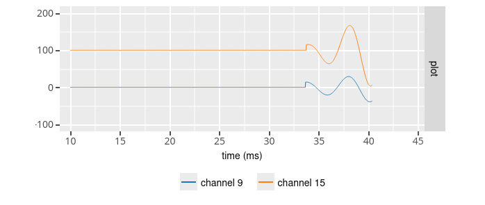
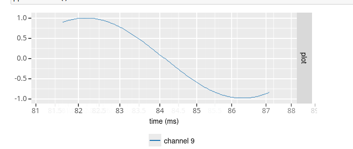
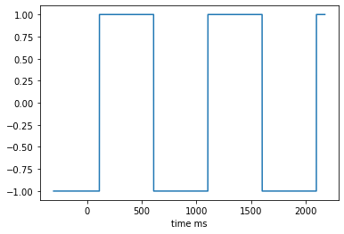

Neuralynx testbench
===================

The neuralynx testbench is a tool to generate a network stream of raw
Neuralynx Digilynx data packets, which can be read by the NlxReader
processor. It enables testing of falcon processing graphs without the
need to be connected to a live Neuralynx acquisition system.

The testbench comes with a number of built-in signal sources, including
a wave generator (sine, square and white noise) and signals read from file.
Sources are defined in a configuration file and can be selected using
keyboard commands.

Configuration
-------------

The testbench tool needs to be configured before use to set the IP address and
network port for streaming data packets. By default, the program will look for
a configuration file in the $HOME/.config/falcon/nlxtestbench.yaml folder and if this file does
not exist, a new one will be created with default values. A configuration file
can also be specified on the command line (see below).

The configuration file is written in YAML format and generally has three
sections (network, stream and sources) with configurable options. An example
configuration file is shown below:

.. code-block:: yaml

    network:
      ip: 127.0.0.1
      port: 5000
    stream:
      rate: 32000
      npackets: 0
      autostart: ""
    sources:
      - class: nlx
        options:
           file: /path/to/raw/data/file
           cycle: false
      - class: sine
        options:
           offset: 0.
           amplitude: 1.
           frequency: 1.
           sampling_rate: 32000
           noise_stdev: 0
      - class: square
        options:
           offset: 0.
           amplitude: 1.
           frequency: 1.
           duty_cycle: 0.5
           sampling_rate: 32000
           noise_stdev: 0
      - class: noise
        options:
           mean: 0.
           stdev: 1.
           sampling_rate: 32000
      - class: ripple
        options:
             ripple params:
                *:
                   duration: 100
                   interval: 50
                9:
                   duration: 50
                   interval: 80
                15:
                   duration: 20
                   interval: 40
             ripple frequency: 200
             mean ripple amplitude: 100
             sampling_rate: 3200
             noise_stdev: 0
             nchannels: 128
             offset: 0

network options
...............

The *ip* and *port* options specify the destination of the streamed data
packets. By default, the IP address is 127.0.0.1 (i.e. local host) and
port is 5000.

stream options
..............

The neuralynx testbench tool produces a stream of data packets that are
identical to the packets generated by the Digilynx system. Each data packet
contains a single data sample for a number of input channels. At the moment,
the testbench only supports a fixed number of 128 channels.

The *rate* option defines the desired rate at which data packets should be
produced (in data packets per second). Note that data packets will be produced
as close as possible to the desired rate, but the actual rate may be lower
if the system cannot keep up.

The *npackets* option defines how many data packets should be produced.
A value of 0 means that all data packets in the signal source should be
streamed out (which in many cases is an infinite data stream).

The *autostart* option sets the signal source that should be streamed
immediately when the testbench is started (i.e. without waiting for a keyboard
command by the user to select the signal source).

sources
.......

The final section of the configuration file lists predefined signal sources.

At present, five different signal sources are available: Neuralynx raw data
file (*nlx*) or generation of a ripple signal (*ripple*), sine wave (*sine*), square wave (*square*) and white noise
(*noise*). To configure a signal source, you need to specify the class of the
source (i.e. nlx, sine, square or noise) and any additional options.
If no sources are specified, then by default a white noise source is added.

Neuralynx raw data (nlx)
************************

To define a signal source that reads raw data packets from a previously
recorded Neuralynx raw data file, you would use the *nlx* source class and set
the *file* option to the path where the raw data file can be found.
Importantly, the raw data file should contain recorded signals from exactly
128 channels.
This is a limitation of the nlxtestbench tool that will
hopefully be removed in the future. All data packets in the file will be
streamed, unless a maximum number of data packets has been specified that is
less than the number of available data in the file (see stream options).
If the *cycle* options is set to true, then streaming of the data in the file
will restart automatically once the end of the file was reached.

Ripple signal (ripple)
**********************

The ripple signal is used to work with the ripple detection graph.
A ripple is characterize by its frequency, its mean amplitude, its duration, its zero interval between two ripples.

This configuration create a

.. code-block::

    ripple wave (fs = 32000.0 Hz, offset = 0.0 uV, noise stdev = 0.0 uV, number of channels = 128, convert byte order = 1,
    For all channels : mean ripple amplitude = 100.0 uV, ripple frequency = 200.0 Hz, ripple duration = 100 ms, zero signal interval = 50 ms
    Except for channel 9 : ripple duration = 50 ms, zero signal interval = 80 ms
    Except for channel 15 : ripple duration = 20 ms, zero signal interval = 40 ms )

Periodic signal (sine / square)
*******************************
To define a source that generates a periodic signal, you would use the
*sine* and *square* source class. You then specify the *offset*
(in microVolt), *amplitude* (in microVolt) and *frequency* (in Hz) of the
sine/square wave. In addition, you can specify a sampling rate other than
32 kHz using the *sampling_rate* option. And finally, noise may be added to
the signal by setting the *noise_stdev* option to the standard deviation of
a Gaussian noise distribution (in microVolt).

White noise (noise)
*******************

To define a source that generates white noise, you would use the *noise*
class. You can specify both the *mean* and standard deviation (*stdev*) of the
Gaussian noise distribution (in microVolt). You can specify a sampling rate
other than 32 kHz using the *sampling_rate* option.

Launch the test bench
---------------------

::

    nlxtestbench -c /path/to/config/file -a 1

Command-line options
********************

::

    usage: ./nlxtestbench [options] ...
    options:
      -c, --config       configuration file (string [=$HOME/.nlxtestbench/config.yaml])
      -a, --autostart    source to auto start streaming (int [=-1])
      -r, --rate         data stream rate (Hz) (double [=-1])
      -n, --npackets     maximum number of packets to stream (0 means all packets) (long [=-1])
      -?, --help         print this message

Keyboard commands
-----------------

After starting the testbench, the following keys are available:

======= ===============================
key     action
======= ===============================
<space> list all defined sources
a-z     select signal to stream
<ESC>   quit
======= ===============================
